# Deploying a LEMP Stack Application On AWS Cloud

A LEMP Stack application is an application which as opposed to a [LAMP Stack Application](https://github.com/Micah-Shallom/Deploying_A_LAMP_Stack_Application_on_AWS_Cloud/blob/main/project.md, 'My github article on LAMP Stack deployment') makes use of Nginx as the web server for hosting the web application. NGINX is an open source software for web serving, reverse proxying, caching, load balancing, media streaming, and more.

## Creating an Ubuntu EC2 Instance
Login to AWS Cloud Service console and create an Ubuntu EC2 instance. The virtual machine is a linux operating system which serves as the backbone for the LEMP Stack web application. 

![creating_ec2_instance]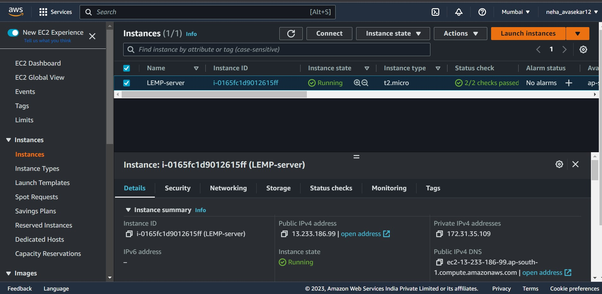

Login into the instance via ssh:
![login_into_ec2_instance]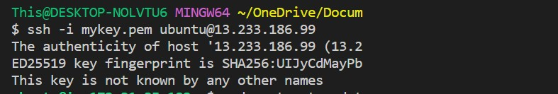

## Installing Nginx

Run a `sudo apt update` to download package information from all configured sources.

![sudo_update]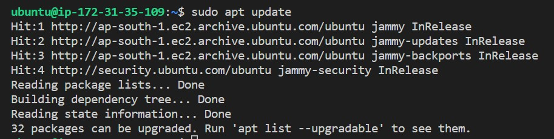

`sudo apt install nginx`

![nginx_installation]

Spin up the nginx server and ensure it automatically starts on system reboot by running the following commands
```
sudo systemctl start nginx
sudo systemctl enable nginx
```
Run `systemctl status nginx` to check if the installation succeeds. A green text color shows that the server is active.

![nginx_installation_success]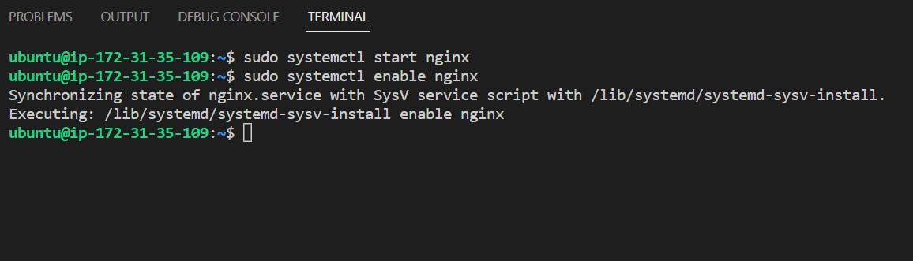

Accessing the default nginx web server block to see if everything works correctly. `curl` the local IP address of our local machine which in most case is `127.0.0.1` or the DNS name `localhost` on any web browser on our local machine.<br/> 
`curl http://127.0.0.1:80 or curl http://localhost:80`

The below result shows nginx has been properly set up and we can deploy our web application.

![testing_nginx_localhost]
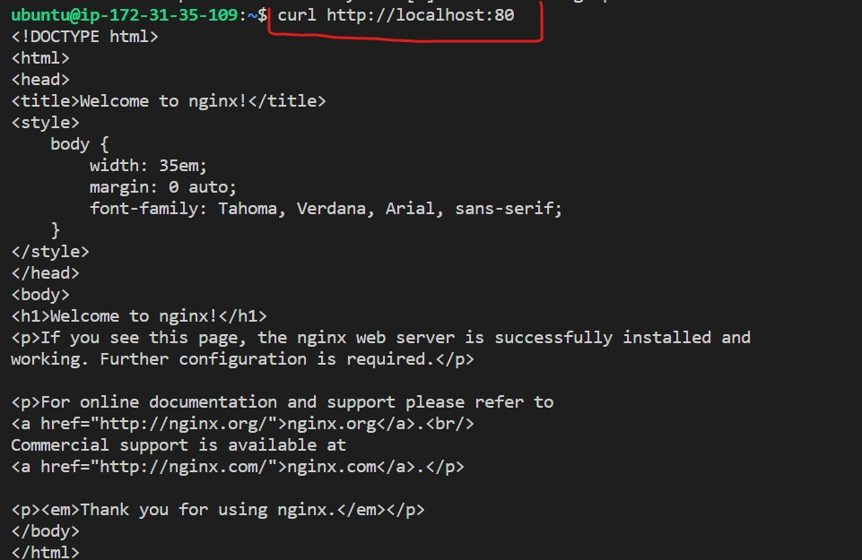

It appears our default nginx server is accessible locally on our local machine. To check if we can access the default server block over the internet on our local machine, insert the public IP address of the server on a browser.

![failed_connection]

The search failed because there was no access to our nginx webserver over the internet even though we were using a public IP address. To correct this, we need to configure inbound security group rules for ubuntu ec2 instance on aws cloud.
**Enable TCP port 80**
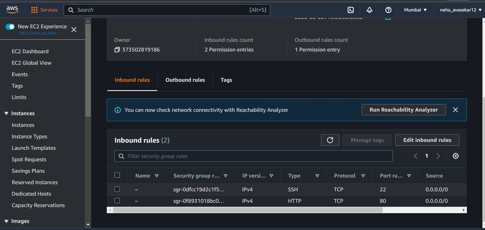

When we insert our public IP address on our browser, the nginx default webpage shows up showing that the webserver block is now visible from the internet via the port 80 which was opened.

![nginx_success]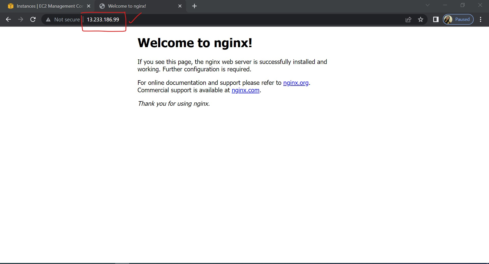

## Installing MySQL 

We have succeeded in setting up our nginx webserver and ensured its accessible over the internet. Next is to install mySQL which is a relational database management server to help store data and manage content on our web application.

Run `sudo apt install mysql-server` 

![mysql_installation]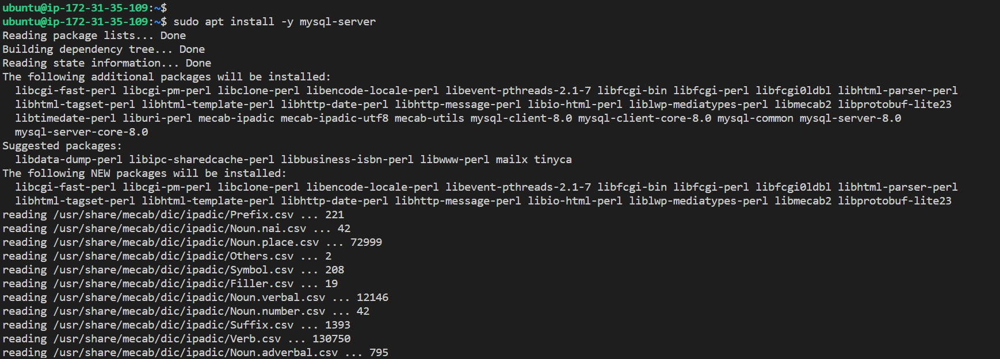

Provide added security to our mysql server by running `sudo apt install mysql-secure_installation`. This script will remove some insecure default settings and lock down access to our database system.

![mysql_secure_installation]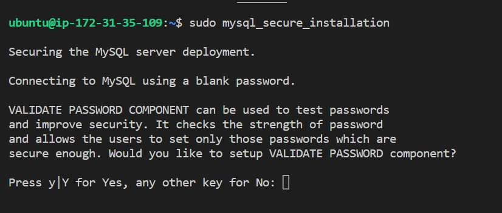

On each prompt that comes press Y , add a password and save.

With mysql_server successfully configured, login into the mysql server.

`sudo mysql`

![mysql_login]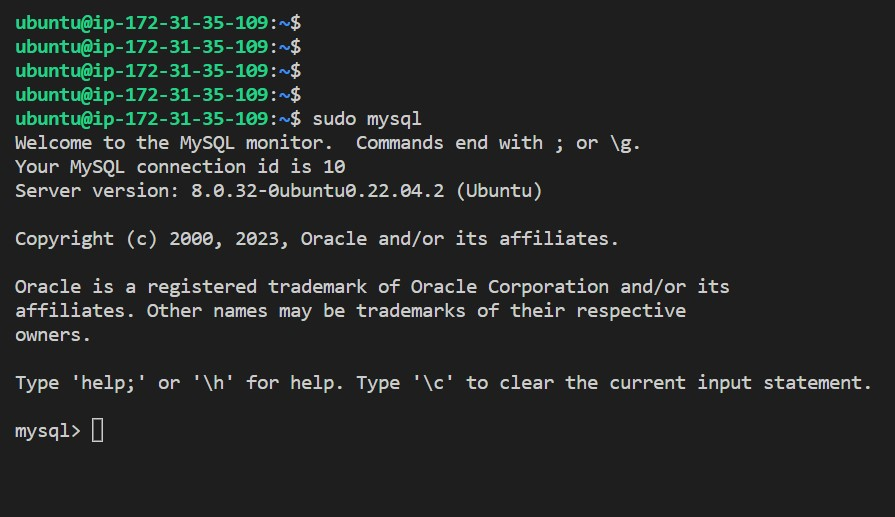

To exit from the web server we enter `exit`


## Installing PHP and its Modules
We use php to dynamically display contents of our webpage to users who make requests to the webserver.

Run `sudo apt install php-fpm php-mysql` <br/>
>php-fpm : which stands for PHP FastCGI Process Manager is a web tool used for speeding up the performance of a website by handling tremendous amounts of load simultaneously.

![php_installation]

## Creating a Web Server Block For our Web Application

To serve our webcontent on our webserver, we create a directory for our project inside the `/var/www/` directory. 

`sudo mkdir /var/www/projectlempstack`
Then we change permissions of the projectlampstack directory to the current user system

`sudo chown -R $USER:$USER /var/www/projectlempstack`

![projectlempstack_creation]

Creating a configuration for our server block<br/>
`sudo nano /etc/nginx/sites-available/projectlempstack`

The following snippets represents the configuration required for our web server block to be functional
```
#/etc/nginx/sites-available/projectlempstack

server {
    listen 80;
    server_name projectlempstack www.projectlempstack;
    root /var/www/projectlempstack;

    index index.html index.htm index.php;

    location / {
        try_files $uri $uri/ =404;
    }

    location ~ \.php$ {
        include snippets/fastcgi-php.conf;
        fastcgi_pass unix:/var/run/php/php7.4-fpm.sock;
     }

    location ~ /\.ht {
        deny all;
    }

}
```

We then link the configuration file to the sites-enabled directory

`sudo ln -s /etc/nginx/sites-available/projectlempstack /etc/nginx/sites-enabled`

To test our configuration for errors we run<br/>
`sudo nginx -t`

![configuration]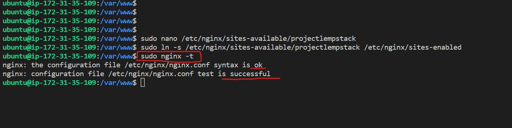

Currently our new server block has been created and configured but currently the default server block is the default block that comes with nginx install. To unlink it we `sudo unlink /etc/sites-available/default`. <br/>

We then reload nginx for all configurations to take effect `sudo reload nginx`.

Create an index.html file inside `projectlempstack` directory and write in contents to be accessed over the internet. Paste public IP address on a browser to see content.<br/>
`http://<public-ip>:80`
![hosted_page]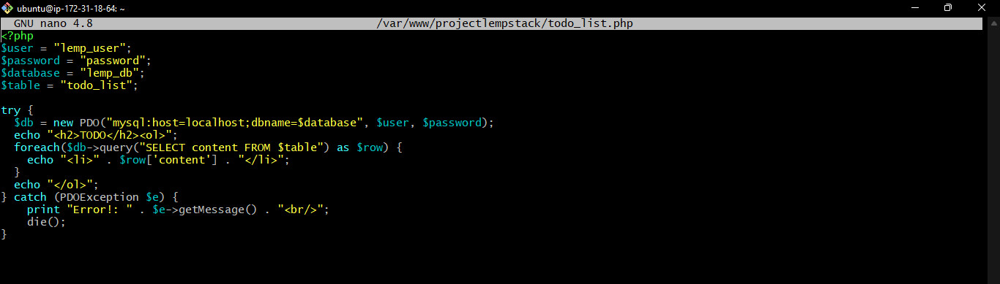

##Serving PHP Using Nginx

Create an `info.php` file inside the `/var/www/projectlempstack` directory.

On a browser enter `http://<public-ip>/info.php`

![served_php]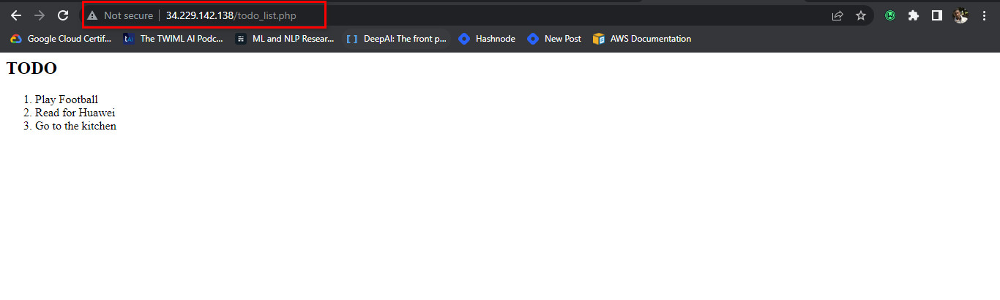


 ## Connecting PHP with MySQL and Fetching Content

 Login into our mysql-server `sudo mysql`.<br/>

 Create a new database `CREATE DATABASE <db_name>`

 Create a new user and assign user a password `CREATE USER 'db_user'@'%' IDENTIFIED WITH mysql_native_password BY 'db_password'` .

 Grant the user permission over the created database `GRANT ALL ON 'db_name'.* TO 'db_user'@'%'`

 `exit` from the mysql-server in which we are currently logged in as root user and then Login into mysql server using the created user.

 ![mysql_dbuser_setup]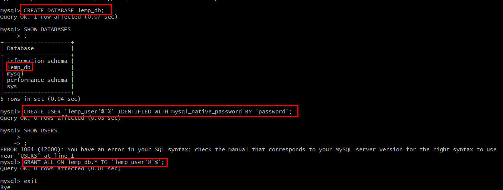
 

 `mysql -u lemp_user -p`

 
We create a table for the current user inside the lemp_db database and specify content parameters

```
CREATE TABLE lemp_db.todo_list(
    item_id INT AUTO_INCREMENT,
    content VARCHAR(255),
    PRIMARY KEY (item_id)
);
```

Push in contents into the table 
`INSERT INTO lemp_db.todo_list(content) VALUES ('enter contents')`

![table_insertion]

Create a php file `todo_list.php` in /var/www/projectlempstack directory and paste the following code

![php_code]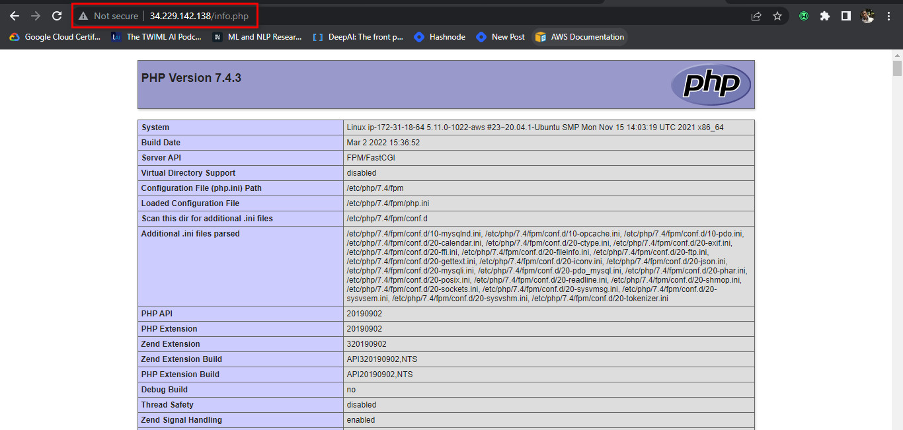

We can then access our webpage via a browser
`http://<publicIP>/todo_list.php`

![php_served]